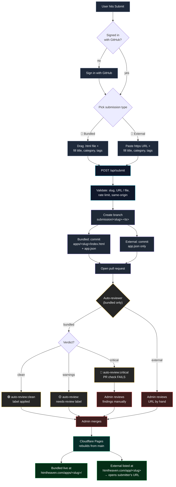
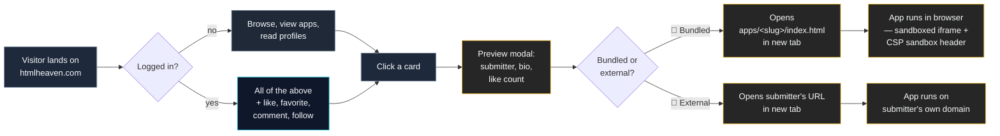

<div align="center">

# HTML Heaven

**A community-curated showcase of single-file HTML5 apps, built on an open-source codebase.**
Tiny web apps made by people, running in your browser.

[htmlheaven.com](https://htmlheaven.com) · [Submit an app](https://htmlheaven.com/submit) · [Browse](https://htmlheaven.com/browse)

</div>

---

## What this is

HTML Heaven is a curated catalog of **self-contained HTML5 mini-applications** — a game, a pomodoro timer, a color picker, a language flashcard deck, a counter-pick tool, an AI "skill" as HTML. Anything that fits in one `.html` file and runs in a browser, or a small app you already host on your own domain.

The idea: you've probably prompted ChatGPT or Claude for "a single-file pomodoro in HTML" a dozen times. Those tiny apps are genuinely useful but end up rotting in your `Downloads/` folder. HTML Heaven is a place to put them, and a place to find other people's.

**The code that runs the site is open-source under MIT.** The catalog itself is community-curated — submissions go through review before they go live, and the admin can remove entries that don't fit. That's the distinction: the tooling is something you can fork, self-host, and inspect; the showcase is a moderated collection rather than a free-for-all.

## Features

- **Browse** — category pills, tag filters, grid or grouped view, search, sort by newest / A-Z / most liked
- **Submit flow** — drag & drop an HTML file, fill a title + category + tags, done. Creates a pull request on this repo with the file + metadata
- **Auto-reviewer** — GitHub Action scans every submission PR for leaked secrets, trackers, cryptominers, external scripts, and phishing patterns. Flags suspicious ones for manual review, blocks PRs with obvious secrets
- **Social profiles** at `/u/<handle>` — avatar, bio, location, website, GitHub/X/Reddit links, submitted apps, likes received, followers
- **Likes, favorites, comments** — one like per user per app (enforced by the DB), comments cross-posted to the app's original GitHub PR so the author gets notified
- **Preview modal** — click any card to see the app's details, submitter, and like count before launching
- **OG / Twitter previews** — sharing a link to the site / an app / a profile generates a custom social card
- **Auto-deploy** — push to `main`, Cloudflare Pages rebuilds, live in ~90s

## How to contribute

There are two paths. Pick whichever fits.

### Path 1 — Submit an app (no git required)

Takes 30 seconds. Sign in with GitHub at [htmlheaven.com/submit](https://htmlheaven.com/submit), then pick one of:

**📄 Host it here (bundled)** — you have a single `.html` file. Drag it onto the upload area, fill in a title, category, and tags, submit. The file goes into the repo under `apps/<your-slug>/index.html`, is rebuilt on deploy, and runs at `htmlheaven.com/apps/<your-slug>/` in a sandboxed iframe. Auto-reviewed by CI for secrets, trackers, cryptominers, phishing patterns.

**🔗 I'm already hosting it (external)** — your app already lives on your own domain. Paste the https URL, fill in the same title/category/tags, submit. The repo gets a metadata-only PR (no HTML); the catalog listing opens your site in a new tab. Must be publicly viewable (no login wall) and served over https. There's no code scan for this path — the admin eyeballs the link before merging, and broken links get removed.

Either way, submission creates a pull request on this repo. Clean ones are merged; the live site redeploys in ~90s.

### Path 2 — Work on the platform itself

If you want to ship features to the site, open a PR here the usual way. Things I'd happily take help on:

- **Activity feed** — see what people you follow are submitting and liking
- **Notifications** — when someone comments on your app or follows you
- **"Remix" flow** — one-click fork an existing app into a new submission
- **In-browser editor** — code + live preview before submitting
- **Discover page** — trending, new-this-week, by-category highlight reels
- **Federated login** — Google / email-link alongside GitHub
- **Better test coverage**

See [Local development](#local-development) below.

## The submit + review flow



## The view flow



## Project layout

```
html-heaven/
├── apps/                          # The actual HTML5 apps (the catalog)
│   ├── pomodoro-timer/
│   │   ├── index.html             # Self-contained single file
│   │   └── app.json               # Title, slug, tags, category, author
│   └── …
├── scripts/
│   ├── generate-manifest.ts       # apps/ → public/apps/ (injects back badge,
│   │                              #   generates src/generated/manifest.json)
│   └── review-submission.mjs      # Static analysis used by CI
├── schema.sql                     # D1 schema
├── src/
│   ├── app/                       # Next.js App Router pages
│   │   ├── page.tsx               # Home
│   │   ├── browse/
│   │   ├── u/[handle]/            # Public profile
│   │   ├── app/[slug]/            # App detail + iframe player
│   │   ├── submit/                # Submit form
│   │   ├── settings/profile/      # Edit own profile
│   │   └── api/                   # Route handlers
│   ├── components/                # React UI
│   └── lib/
│       ├── apps.ts                # Manifest reader + top-apps query
│       ├── categories.ts          # Category/tag definitions
│       ├── db.ts                  # D1 helpers
│       ├── users.ts               # Profile / follow helpers
│       └── github.ts              # Octokit wrappers (create submission PR,
│                                  #   auto-merge delete PRs, post comments)
└── .github/workflows/
    ├── deploy.yml                 # Build + deploy to Cloudflare Pages
    └── review-submission.yml      # Auto-review incoming submission PRs
```

## Tech stack

- **Framework** — [Next.js 16](https://nextjs.org) (App Router) + TypeScript
- **Styling** — [Tailwind CSS v4](https://tailwindcss.com)
- **Auth** — [NextAuth v5](https://authjs.dev) with GitHub provider
- **Database** — [Cloudflare D1](https://developers.cloudflare.com/d1/) (SQLite at the edge) for favorites, likes, comments, follows, profiles, submission records, soft-delete flags
- **Storage** — app files live in the git repo; copied to `public/apps/` at build time
- **Deploy** — [OpenNext](https://opennext.js.org/cloudflare) → Cloudflare Pages / Workers
- **CI** — GitHub Actions (auto-review submissions, build + deploy on merge)

Everything runs on Cloudflare free tiers. Total infrastructure cost: the domain registration.

## Local development

```bash
# 1. Clone and install
git clone https://github.com/GergelyKrista/html-heaven.git
cd html-heaven
npm install

# 2. Environment — see .env.example for the full list.
# Minimum for local dev:
cp .env.example .env.local
# Fill in: AUTH_GITHUB_ID, AUTH_GITHUB_SECRET, AUTH_SECRET

# 3. Generate the static manifest from apps/
npm run generate-manifest

# 4. Run the dev server
npm run dev           # → http://localhost:3000
```

Note that D1-dependent features (likes, comments, profiles) won't work in `npm run dev` without a local D1 binding. Use `npx wrangler pages dev` with a wrangler.toml-configured binding if you want the full experience.

## Adding an app directly (for maintainers)

If you're bypassing the UI for some reason, there's two `app.json` shapes depending on `hostingType`:

**Bundled** — HTML in the repo:

```bash
mkdir apps/my-new-app
# Drop your index.html in apps/my-new-app/
cat > apps/my-new-app/app.json << 'EOF'
{
  "title": "My New App",
  "slug": "my-new-app",
  "description": "What it does in one sentence.",
  "author": "YourName",
  "tags": ["tools", "calculator"],
  "dateAdded": "2026-04-24",
  "featured": false,
  "hostingType": "bundled",
  "thumbnail": "thumbnail.png"
}
EOF

# Regenerate manifest + back-badge-inject the HTML
npm run generate-manifest
```

**External** — already hosted elsewhere; no HTML file needed:

```bash
mkdir apps/my-external-app
cat > apps/my-external-app/app.json << 'EOF'
{
  "title": "My External App",
  "slug": "my-external-app",
  "description": "What it does in one sentence.",
  "author": "YourName",
  "tags": ["tools"],
  "dateAdded": "2026-04-24",
  "featured": false,
  "hostingType": "external",
  "externalUrl": "https://example.com/my-app"
}
EOF

npm run generate-manifest
```

`generate-manifest` validates both variants and fails the build on bad combinations (external without a URL, non-https URL, bundled without an `index.html`, unknown `hostingType`). Existing entries without a `hostingType` field are treated as `bundled` for backward compat.

## Security & review posture

Every incoming submission PR runs through `.github/workflows/review-submission.yml`, which invokes `scripts/review-submission.mjs`. The scan applies to **bundled** submissions and looks at the added HTML for:

- **Critical** — OpenAI/Anthropic/GitHub/AWS/Google/Slack/Cloudflare tokens, private key blocks, cryptominer scripts, forms that POST to external hosts, oversize files
- **Warning** — external scripts/iframes/imports from unvetted hosts, trackers (GA, FB Pixel, Segment, Mixpanel, PostHog, etc.), `fetch` or XHR to external origins, heavy `eval`/`Function`/`atob` use, hidden iframes, auto-redirects to external URLs
- **Info** — resources from known safe CDNs (jsdelivr, unpkg, cdnjs, Google Fonts)

The bot posts a structured comment with findings and applies one of three labels: `auto-review:clean`, `auto-review:needs-review`, or `auto-review:critical`. Critical findings fail the CI check.

**External submissions** have no HTML to scan — the review gate is manual. The admin opens the submitted link, confirms it loads without a login wall, eyeballs it for phishing / impersonation / obviously malicious content, and merges or closes. Dead links get removed.

Bundled apps are also isolated from the main-origin cookie jar via a response-level `Content-Security-Policy: sandbox` header, so a malicious submission opened in a new tab can't act as the logged-in viewer via same-origin `fetch`. External apps open on the submitter's own domain and aren't iframed.

This is first-pass automation, not a substitute for human review. The admin still reviews anything non-trivial.

## License

MIT — see [LICENSE](./LICENSE). Do whatever you want with the code. For individual apps under `apps/`, each submitter retains the license they chose (most are MIT by default — if an app has a LICENSE file in its folder, that one governs). Externally-hosted apps are governed by whatever license / terms their own site specifies.

## Credits

Built by [@GergelyKrista](https://github.com/GergelyKrista). Community-powered by everyone who's uploaded an app — see the [contributors](https://github.com/GergelyKrista/html-heaven/graphs/contributors).
